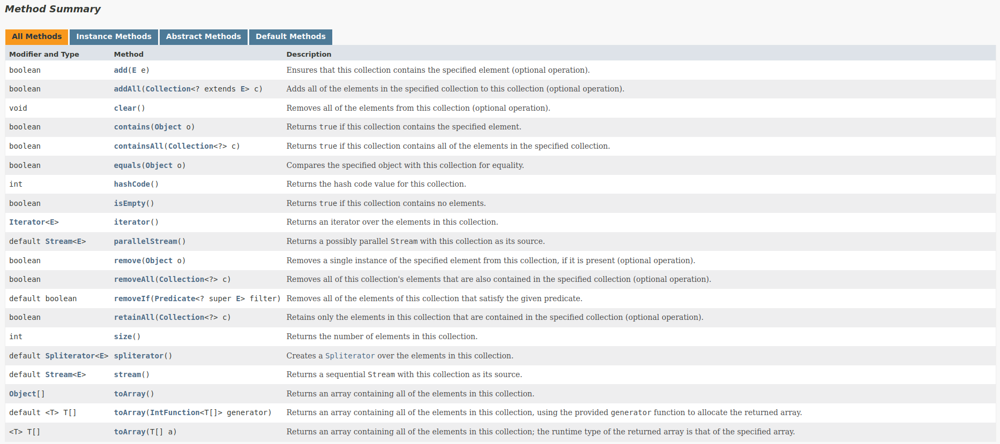

# collection Framework API
### Conhecendo a Hierarquia do Collection Framework API Java
- Uma coleção (collection) é uma estrutura de dados que serve para agrupar muitos elementos em uma única unidade, estes elementos precisam ser Objetos.
- Uma Collection pode ter coleções homogêneas e heterogêneas, normalmente utilizamos coleções homogêneas de um tipo específico.
- O núcleo principal das coleções é formado pelas inrterfaces conforme figuta abaixoS, essas interfaces permitem manipular a coleção independente do nível de detalhe que elas representam.
- Temos quatro grandes tipos de coleções: List (lista), Set (conjunto), Queue (fila) e Map (mapa), a partir dessas inferfaces, temos muitas subclasses concretas que implementam várias formas diferentes de se trabalhar com cada coleção.

https://data-flair.training/blogs/collection-framework-in-java/

- Todas as interfaces e classes são encontradas dentro do pacote (package) java.util.
- Embora a interface Map não ser filha direta da interface Collection, ela também é considerada uma coleção devido a sua função.

https://docs.oracle.com/en/java/javase/17/docs/api/java.base/java/util/Collection.html

### Referências:

[1] "Java Collections - Universidade Java."Universidade Java. Disponível em: 
http://www.universidadejava.com.br/java/java-collection/.

[2] "Java™ Platform, Standard Edition 17 API Specification - Interface Collection." Oracle. Disponível em: 
https://docs.oracle.com/en/java/javase/17/docs/api/java.base/java/util/Collection.html.

[3] "Java Comparator and Comparable - Baeldung." Baeldung. Disponível em: 
https://www.baeldung.com/java-comparator-comparable.

[4] "Java™ Platform, Standard Edition 17 API Specification - Class Collections." Oracle. Disponível em: 
https://docs.oracle.com/en/java/javase/17/docs/api/java.base/java/util/Collections.html.

